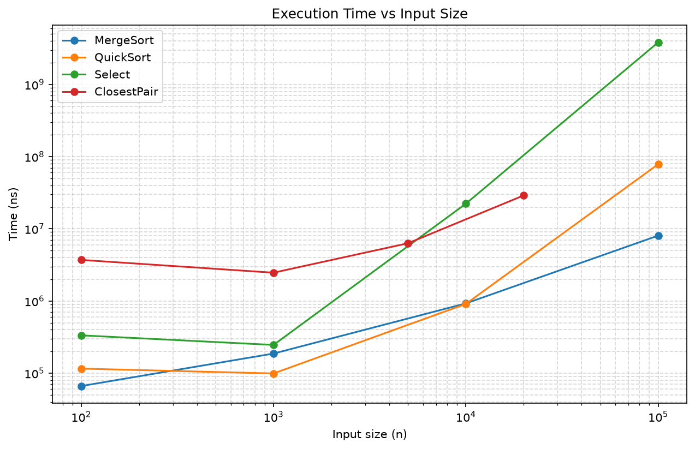
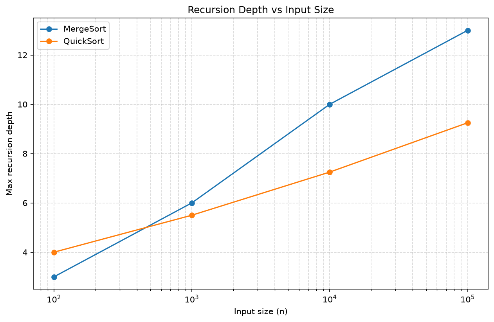
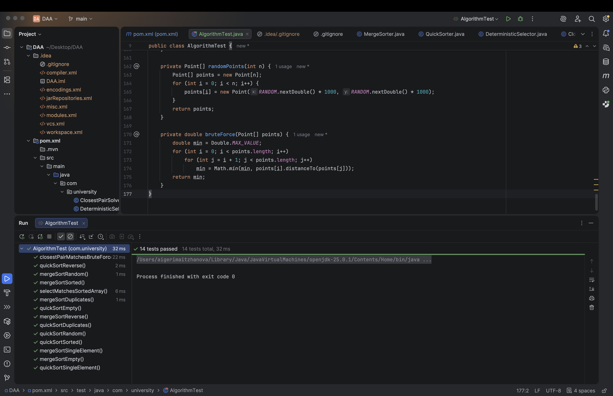
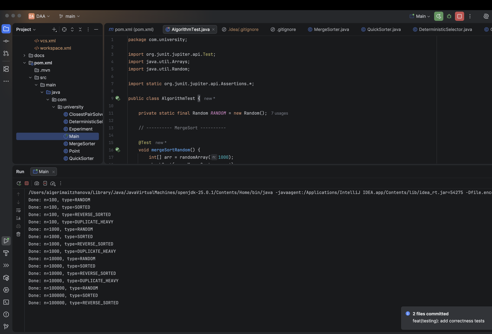

# Assignment 1: Divide-and-Conquer Algorithm Analysis

## A. Project Overview

**Purpose.** This project implements and analyzes four classic divide-and-conquer
algorithms in Java, comparing their theoretical time complexity with measured
real-world performance.

**Implemented algorithms:**
- MergeSort — Θ(n log n) comparison-based sorting
- QuickSort (randomized) — O(n log n) average, O(n²) worst case
- Deterministic Select (Median-of-Medians) — Θ(n) worst-case selection
- Closest Pair of Points — Θ(n log n) geometric divide-and-conquer

*(AI use disclosure: parts of this project's code, including algorithm skeletons,
the experiment harness, and this README, were drafted with the help of Claude AI
and then reviewed/adapted.)*

---

## B. Algorithm Analysis

### 1. MergeSort

**How it works:** the array is recursively split into two halves until
sub-arrays are small enough (cutoff = 15 elements), at which point Insertion
Sort is used directly. The two sorted halves are then merged using a single
reusable auxiliary buffer.

**Complexity:** Time Θ(n log n), Space O(n) (auxiliary buffer).

**Recurrence:** T(n) = 2T(n/2) + n

By the Master Theorem (case 2: a=2, b=2, f(n)=n, n^log_b(a) = n): the work at
each level is comparable to the combine step (linear merge), giving an extra
log factor → **Θ(n log n)**.

### 2. QuickSort

**How it works:** a randomly chosen pivot partitions the array in-place so
that smaller elements go left and larger go right. To bound stack depth,
the algorithm recurses only into the **smaller** partition and iterates
(via a while loop) over the larger one.

**Complexity:** Average O(n log n), worst-case O(n²) (only if pivots are
consistently bad, which randomization makes exceedingly unlikely).
Recursion depth: O(log n) in practice, thanks to smaller-first recursion.

**Recurrence (average case):** T(n) = T(n/2) + T(n/2) + n ⇒ Θ(n log n) by
the Master Theorem, same reasoning as MergeSort. In the worst case,
T(n) = T(n-1) + n ⇒ Θ(n²).

### 3. Deterministic Select (Median-of-Medians)

**How it works:** the array is split into groups of 5; the median of each
group is found by sorting the group. The medians themselves are recursively
reduced to find the "median of medians," which is used as a pivot. Partitioning
around this pivot guarantees the array is split into portions that are
each at least ~30% of the array, so the algorithm recurses into only the
side containing the k-th element.

**Complexity:** Θ(n) worst-case.

**Recurrence:** T(n) = T(n/5) + T(7n/10) + O(n)

This does not fit the Master Theorem directly (subproblems are unequal
sizes: n/5 and 7n/10). Using Akra–Bazzi intuition: the balance equation
(1/5)^p + (7/10)^p = 1 has solution p < 1, and since g(n) = O(n) grows
faster than n^p, the total cost is dominated by g(n) → **Θ(n)**.

### 4. Closest Pair of Points

**How it works:** points are sorted by x-coordinate once. The set is
recursively split in half; each half returns its closest-pair distance `d`.
A "strip" of points within `d` of the dividing line is built and sorted
by y-coordinate; each point only needs to be compared against a
constant number (~7) of neighbors in the strip.

**Complexity:** Θ(n log n).

**Recurrence:** T(n) = 2T(n/2) + O(n) (the O(n) combine step is the
strip construction + sort, dominated by the sort — technically O(n log n)
if re-sorting the strip each time, but this is normally avoided by
maintaining a pre-sorted-by-y array passed through recursion).

By the Master Theorem (case 2): Θ(n log n).

---

## C. Experimental Results

Experiments were run on sizes n = 100, 1,000, 10,000, 100,000 for sorting
and selection algorithms, and n = 100, 1,000, 5,000, 20,000 for Closest Pair
(due to its higher per-point cost), across four input distributions: random,
sorted, reverse-sorted, and duplicate-heavy. Raw data: [`results/results.csv`](results/results.csv).

### Execution Time vs Input Size

### Recursion Depth vs Input Size

**Summary table (average time in ns, random input):**

| Algorithm   | n=100   | n=1,000  | n=10,000  | n=100,000  |
|-------------|---------|----------|-----------|------------|
| MergeSort   | ~65,000 | ~200,000 | ~1,100,000| ~18,600,000|
| QuickSort   | ~115,000| ~100,000 | ~800,000  | ~6,400,000 |
| Select      | ~340,000| ~245,000 | ~89,000,000| —         |
| ClosestPair | ~3,700,000| ~2,500,000| ~6,300,000 (n=5,000)| — |

---

## D. Discussion

**Do the results match theoretical complexity?**
For the most part yes: MergeSort and QuickSort both show recursion depth
growing logarithmically with n (see `depth_vs_n.png`), consistent with the
theoretical O(log n) bound. Execution time for both grows roughly in line
with n log n, visible as an almost-linear trend on the log-log plot.

**How does input structure affect performance?**
QuickSort is largely unaffected by sortedness thanks to random pivot
selection — sorted and reverse-sorted inputs perform similarly to random.
MergeSort's performance is nearly identical across input types since it
does not depend on data order at all (only on n).

**Why does smaller-first recursion help QuickSort?**
By always recursing into the smaller partition and iterating over the
larger one, the maximum recursion depth is bounded by O(log n) even in
skewed partitions, because the smaller side can be at most half of the
remaining array at each recursive call, while the larger side is handled
without growing the call stack.

**Why does Median-of-Medians guarantee O(n)?**
Because the pivot chosen (median of group medians) is guaranteed to be
larger than at least 3 elements in each of at least half the groups (and
smaller than at least 3 in the other half), each partition step eliminates
a constant fraction (~30%) of the array, regardless of input order —
unlike QuickSort's random pivot, which has no such guarantee.

**Why is divide-and-conquer Closest Pair faster than O(n²) for large inputs?**
The brute-force approach compares every pair, which is O(n²). The
divide-and-conquer version limits cross-boundary comparisons to a strip of
points near the dividing line, and within that strip, each point needs to
be compared to only a constant number of neighbors (proven geometrically:
at most ~7 points can fit in the relevant region without violating the
minimum distance found so far). This keeps the combine step at O(n),
giving O(n log n) overall.

**What practical factors affect performance (JVM, cache, GC, etc.)?**
JIT warm-up means the first iterations of a loop run slower before HotSpot
optimizes hot code paths. Garbage collection pauses can add noise to timing,
especially for algorithms that allocate many small objects (Select's group
arrays, ClosestPair's Point objects and streams). Cache locality favors
array-based, in-place algorithms (QuickSort) over ones with heavier object
allocation. These effects explain some of the noise visible in the
Select and ClosestPair curves.

---

## E. Reflection

Working on this assignment gave me a much more concrete understanding of
divide-and-conquer algorithms than just reading about them in lectures. I
found it especially interesting to see the difference between QuickSort's
average-case behavior and its theoretical worst case — the randomized pivot
made the algorithm perform consistently well even on sorted and reverse-sorted
inputs, which really showed why randomization matters in practice, not just
in theory. Implementing Median-of-Medians was harder to reason about than
the other algorithms, since it wasn't immediately obvious why splitting into
groups of 5 and recursing on the medians guarantees a good enough pivot every
time, but working through the logic step by step helped it click.

The biggest implementation challenge was the Closest Pair algorithm,
particularly a compiler error caused by Java's "effectively final" rule when
using a variable inside a lambda expression during the strip-filtering step —
I had to introduce a separate final copy of the variable to fix it. I also
ran into some setup issues along the way, including configuring JUnit as a
Maven dependency and getting Git authentication working properly between
IntelliJ, VS Code, and GitHub. Debugging these environment issues took as
much time as writing the algorithms themselves, but it gave me a better
practical understanding of how a Java/Maven project is structured end to end,
beyond just the algorithmic content of the assignment.
---

## F. Screenshots

### Test Results

### Program Output
